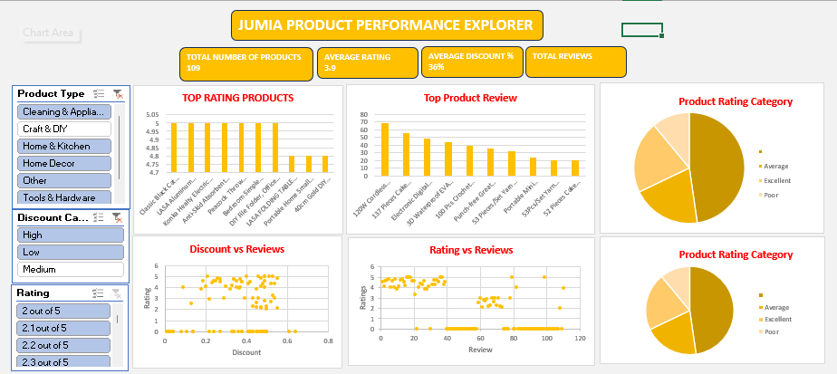

Dashboard Preview

  

📊 JUMIA PRODUCT PERFORMANCE EXPLORER
E-Commerce Product Insights (Jumia Dataset)

📌 Overview:
This project is an Excel-based dashboard analyzing Jumia product data to generate insights on product performance, ratings, reviews, and discounts.

🎯 Objectives:
Clean and prepare raw product data
Create product categories for analysis
Build an interactive Excel dashboard
Analyze relationships between ratings, reviews, and discounts.

📁 Deliverables:
Cleaned and enriched Excel dataset
Interactive Excel dashboard with charts and slicers
GitHub repository with all project files

📊 Dashboard Features:
KPI metrics (Total Products, Avg Rating, Avg Discount)
Top 10 products by rating and reviews
Scatter plots (Rating vs Reviews, Discount vs Reviews)
Pie charts for rating and discount categories
Interactive slicers for filtering

🛠 Tools Used:
Microsoft Excel (Charts, Pivot Tables, Slicers, Data Cleaning)